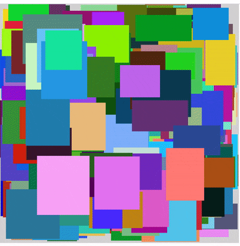

[](https://laniman.github.io/spbfiller-test-assignment/)

# SPBFiller test assignment


> [Live Demo](https://laniman.github.io/spbfiller-test-assignment/)

> [Test assignment](docs/test-assignment.md)

## Information

- Data about the position of the changed block is sent to the Redux Store at the end of the drag (`handleDraggableStop`)
- All blocks are rendered on the screen. There are performance issues when working with a large (50K+) number of blocks
- App config in `src/app/config.js`
- Draggable lib - [`react-use-gesture`](https://github.com/react-spring/react-use-gesture)
- Boilerplate (Redux Toolkit) - [`cra-template-redux`](https://github.com/reduxjs/cra-template-redux)
- [`redux-logger`](https://github.com/LogRocket/redux-logger) is available in the production build to monitor every action

## Development

Checkout this repository locally, then:

```shell
$ yarn install
$ yarn start
```

### Creating a Production Build

```shell
$ yarn build
```

### Run local http server (with `npx http-server ./build`)

```shell
$ yarn serve
```
