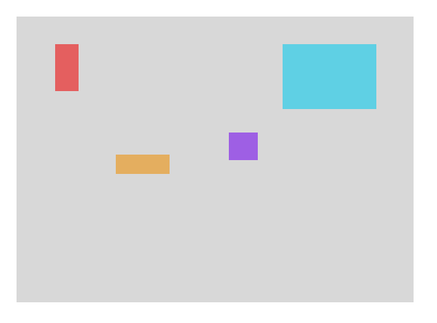

# Тестовое задание SPBFiller

### Стек:

- ECMAScript/TypeScript на выбор
- React
- Redux
- В качестве Boilerplate можно использовать что угодно. (create-react-app или другое)

### Задача:

Пользователь, при входе в приложение, видит блок (серый) с несколькими блоками (`<div />`) разного (любого) размера внутри, для упрощения взаимодействия внутренние блоки раскрашены:



Пользователь может перемещать внутренние блоки по экрану **в пределах** серого блока

Пользователь не должен испытывать проблем с перфомансом в процессе перемещения независимо от количества блоков

Актуальные данные о позиции блоков должны попадать в Redux Store (возможно задержкой, если это необходимо)

Для реализации драга можно взять любую понравившуюся библиотеку

### Пример входных данных для инициализации Redux Store:

```jsx
// Серый блок
const page = {
  width: 400,
  height: 400,
};

// Разноцветные блоки
const elements = [
  { id: 0, width: 100, height: 100, x: 10, y: 10, backgroundColor: '#5FD0E4' },
  { id: 1, width: 40, height: 100, x: 100, y: 200, backgroundColor: '#9E5FE4' },
  // и дак далее
];
```

### Что мы хотим получить в качестве результата

- [ ] Ссылку на GitHub репозиторий с проектом
- [ ] Внутри репозитория в `README.md` файле должна быть инструкция по запуску
